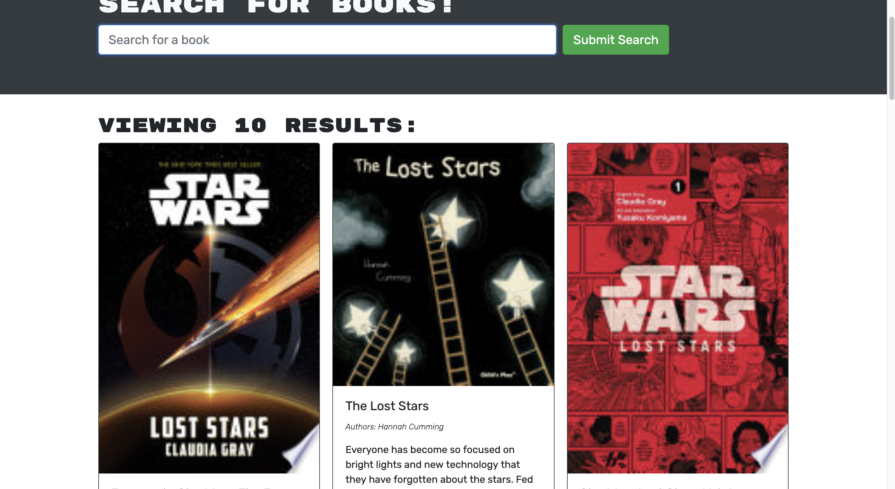
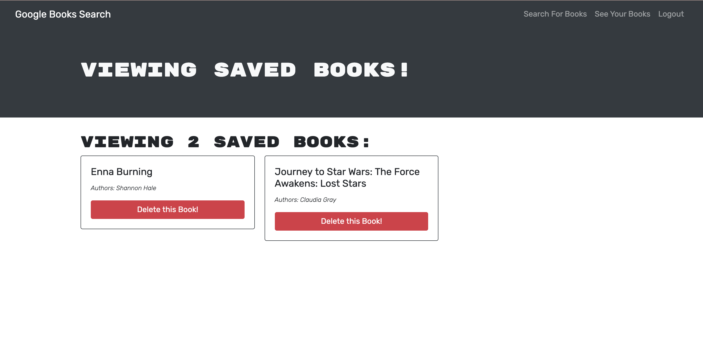

# Book Search Engine

## Description

This application uses GraphQL and Apollo Server to allow users to search books and save them in a list for later reading or purchasing.

## Table of Contents

- [Installation](#installation)
- [Usage](#usage)
- [License](#license)
- [Credits](#credits)
- [Questions](#questions)

## Installation

To use this application, navigate to the deployed Heroku [site](https://rocky-taiga-17481.herokuapp.com/).

_To install this application locally yourself, download and clone the files from this repository. Run 'npm run install' to install the packages in the package.jsons, 'npm run build' to create a build, and 'npm run develop' to start the application in your local browser._

## Usage

If you use the application through the deployed [Heroku site](https://rocky-taiga-17481.herokuapp.com/), simply navigate to and interact with the site from there. Sign up and log in before searching books on the Search for Books page. Save books and view them on the See Your Books page.

_If the program was cloned, downloaded, and installed instead, get the application running by typing "npm run develop" into the command-line. All features of the application are then accessible through localhost on your browser or other applications._

_Search Books_

_My Books_

## Credits

Starter code (of a functioning MERN application) provided by the University of Minnesota Coding Bootcamp. I refactored the starting code to work with GraphQL API and Apollo Server.

## License

This project is licensed under [MIT License](https://opensource.org/licenses/MIT).

## Questions

See more of my work on my [GitHub Profile](https://github.com/msteblu/).
For any additional questions, reach me at my email: megan@steblay.net.
